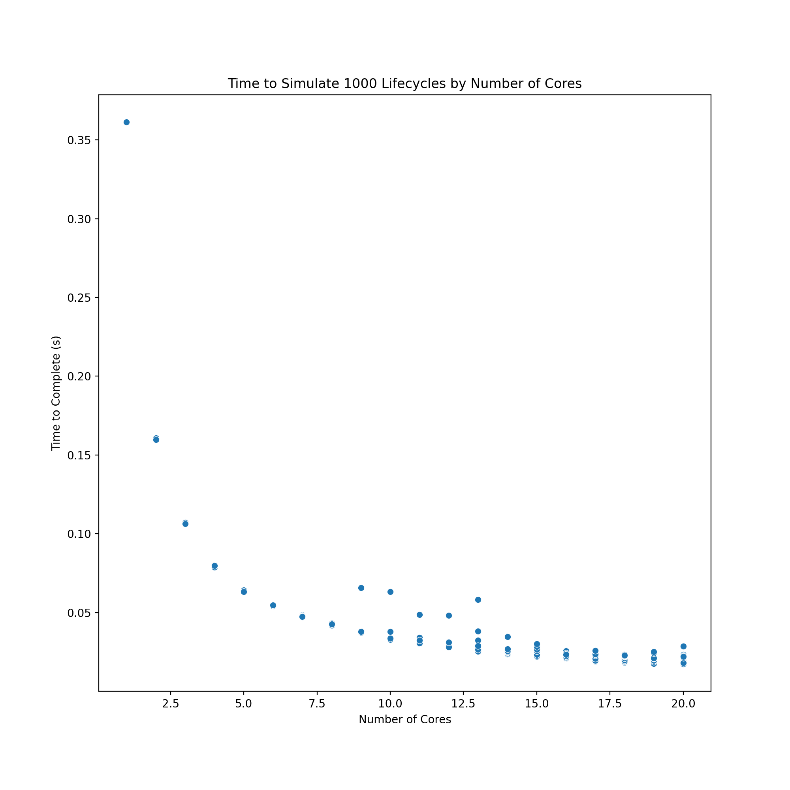

# 1
## (a)

The original version of the code simulated 1000 lifetimes on a single core in 3.431394 seconds (run using health_sim_orig.sbatch and reported in health_sim_orig.out).  
  
The version of the code which used numba to pre-compile the nested for loops simulated 1000 lifetimes on a single core in 0.463110 seconds (run using health_sim_numbacc.sbatch and reported in health_sim_numbacc.out).  
  
By pre-compiling with numba, we saw a speedup from 3.43 seconds to 0.46 seconds, which is a time savings of 2.97 seconds, or equivalently 626% faster than the original script.  
  
## (b)
  

## (c)

The speedup isn't linear because it is limited by the serial components of the process, namely _____

# 2
## (a)
