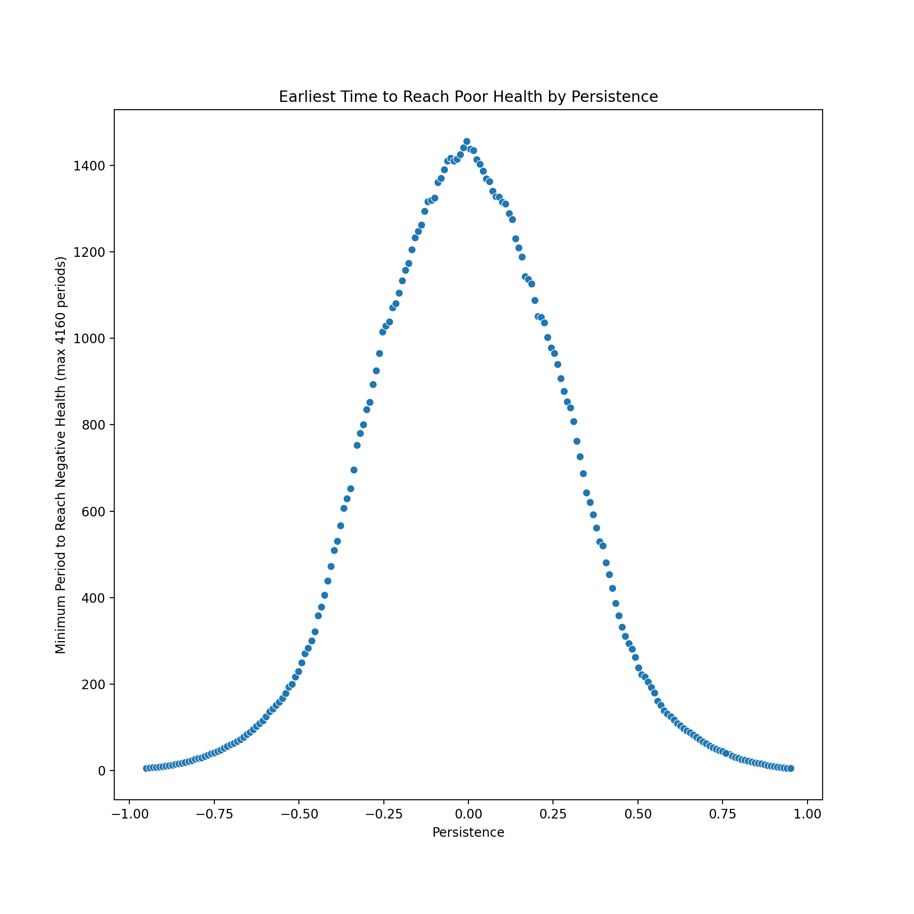

# 1
## (a)

The original version of the code simulated 1000 lifetimes on a single core in 3.431394 seconds (run using health_sim_orig.sbatch and reported in health_sim_orig.out).  
  
The version of the code which used numba to pre-compile the nested for loops simulated 1000 lifetimes on a single core in 0.463110 seconds (run using health_sim_numbacc.sbatch and reported in health_sim_numbacc.out).  
  
By pre-compiling with numba, we saw a speedup from 3.43 seconds to 0.46 seconds, which is a time savings of 2.97 seconds, or equivalently 626% faster than the original script.  
  
## (b)
  

(Values created using mpi_health_sim.sbatch and stored in mpi_health_sim.out. Final plot creation performed in assignment_1_assoc_tasks.ipynb.)

## (c)

The speedup isn't linear because it is limited by the serial components of the process, namely the need to create our initial objects (eps_mat and empty z_mat), as predicted by Amdahl's Law. We're also not increasing the size of the data, which would allow us to see closer to linear speed-up according to Gustafson-Barsis's Law. 

# 2
## (a)
  
The mean time for each core to process its 20 values of persistence over 1000 lifetimes was 1.638 seconds (run using mpi_rho_tests_numbacc.sbatch and reported in mpi_rho_tests_numbacc.out, with final calculations performed in assignment_1_assoc_tasks.ipynb).    
  
## (b)
  
   
    
(Created using code in assignment_1_assoc_tasks.ipynb)  

## (c)
  
The optimal persistence, persistence is 0: with a 0 persistence, it takes approximately 1450 periods to reach a point where health drops below 0.   
  

# 3
## (a)

Running on a single CPU core on Midway, the serial code took 0.659998 seconds to complete (run using landsat_serial.sbatch and recorded in landsat_serial.out).    
    
By contrast, the GPU version on Midway took 0.673488 seconds to complete (run using landsat_gpu.sbatch and recorded in landsat_gpu.out).   

## (b)
  
The GPU implementation is actually slightly slower, which is likely due primarily to needing to transfer our raster arrays to the GPU for processing, then receive them back on the CPU. Transferring data to and from GPUs is a known limitation on speed.  
  
## (c)

When I rerun the serial NDVI calculation with a 10x increase in the data size, the timing is 0.6973, and with a 20x increase in size, the time is 1.2266 (run using landsat_serial_tiled.sbatch and recorded in landsat_serial_tiled.out).  
  
When I perform the parallel NDVI calculation on a GPU using a 10x and 20x size increase, I find it takes 0.9457 seconds for the 10x increase and 1.0716 seconds for the 20x increase (run using landsat_gpu_tiled.sbatch and recorded in landsat_gpu_tiled.out).  
  
It seems the GPU option performs progressively better as we increase the size of the data. This could be due to the benefits of parallelization with large data sets overtaking the slow-down caused by transferring data to the GPU for processing. Nevertheless, we still see the impact of the data transfer time in the relatively minor difference in processing time between the 20x increased serial code (~1.2s) and parallel code (~1.1s). This makes sense, as we'd expect transferring arrays of increasing size to the GPU to take increased time as well, so the benefits of parallelization are diminished (though, at 20x data size, not overshadowed).

